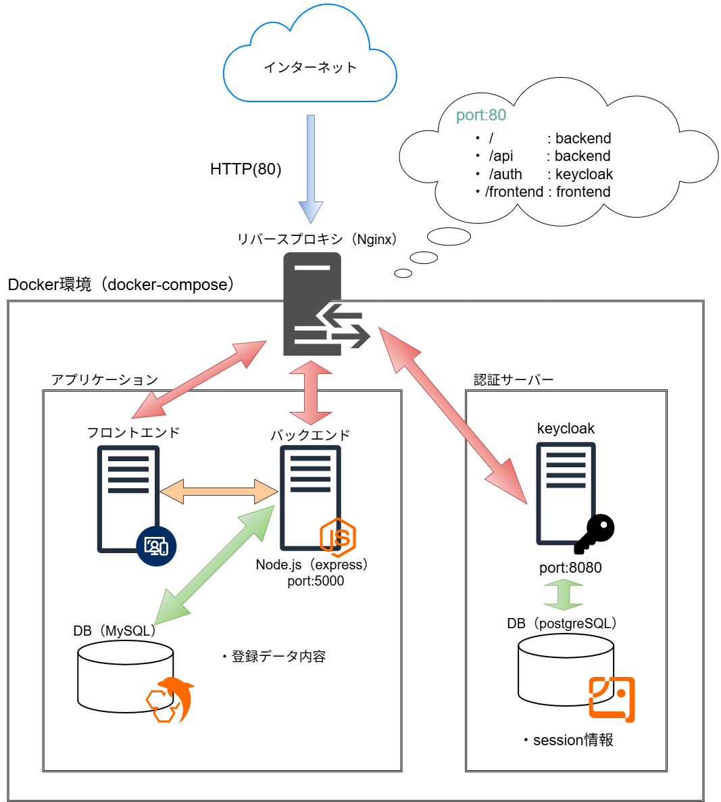

# Game Package Management

## 概要

ゲームパッケージを管理するWebアプリケーションです。

ゲームタイトル、ゲームの種類、プレイ状況、レビューなどを登録・管理できます。

また、認証機能を作成しユーザーごとにデータの管理をするように構成しています。

## 開発動機
<p>Udemyでフロントエンド、バックエンドの基礎、および Docker による環境構築を学んだ際の学習アウトプットとして作成しました。</p>
<p>学んだ知識を統合し、実際に動作するアプリケーションを構築することで、Web開発の全体像を実践的に理解することを目的としています。</p>

## 前提条件
このプロジェクトを実行するには、以下のツールがインストールされている必要があります。
### **Docker / Docker Compose**

## 開発環境


## 使用技術

### フロントエンド
   


### バックエンド
 

### データベース


#### その他ライブラリ
- nodemon: Node.jsアプリケーションを自動的に再起動してくれるツール（開発効率を上げるため）
- multer : アップロードされたファイルをImageディレクトリに保存するために使用（ミドルウェア）
- cors   : 異なるオリジン（ドメイン・ポート等）間での通信を安全に許可するために使用
- dotenv : .envファイル情報をNode.jsで扱えるようにするために使用
- mysql2 : Node.jsからMySQLデータベースを操作する際に使用
- express-session : ユーザーごとのログイン状態などの情報をサーバー側で一時的に保持するために使用（セッション管理）
- openid-client : OpenID Connectに対応した認証クライアントライブラリで、Keycloakと連携してログイン認証を実装するために使用

## 構成図


## 機能
- ユーザー認証機能
- ゲーム一覧表示
- ゲーム情報登録
- ゲーム情報編集
- ゲーム情報削除
- 項目フィルター検索（ゲームの種類別）
- 画像アップロード（backendフォルダ内のImageフォルダに画像データを格納）

## セットアップ手順

### 1. リポジトリを取得

```bash
git clone https://github.com/ena5628/PackageGameManagement.git　
```

### 2. .envファイルの作成

```bash
cd ./PackageGameManagement
cp .env.example .env
```
>.env.example はあくまで設定項目のテンプレートです。
本番環境や個人環境で使用する際は、必ずより強固で推測されにくいパスワード等の値に書き換えてから使用することを強く推奨します。

### 3. docker composeの起動

```bash
docker compose up -d --build
```

### 4.keycloakの設定
ログイン認証を行うために、事前準備として以下の操作を行う必要があります。
- realmsの作成
- clientの作成
- userの作成

ブラウザから下記のURLを入力し、操作を行ってください。<br>
`http://localhost/auth`
- ユーザー名:`admin`
- パスワード:`admin`

#### 事前準備での各項目の設定値
各項目の設定値はバックエンド側と合わせておく必要があります。

もしご自身で値を変更したい場合は、その都度バックエンド側のソースコードを修正してください。

```bash
# realms
realms名: `myapp`

# client
clientID: `myapp-client`
Name: `frontend`
Home URL: `http://localhost`
Valid redirect URIs: `http://localhost/*`
Valid post logout redirect URIs: `http://localhost/*`
Web origins: `*`
>その他の設定はそのままで大丈夫です。

# user
user名:`testuser`       
Credentials: `testuser`
>ここのユーザー設定はご自身で値を設定し、複数ユーザーを作成することを推奨します。
```

Keycloak学習時に操作手順をまとめていますので、よければこちらを参考にして操作を行ってください。

値は上記で示した値に置き替えて操作するようお願いします。

- [Keycloak_SSOの学習](https://github.com/ena5628/Keycloak_SSO#2realmの作成)
> 見出し項目を見て各操作の手順を確認してください。

## 工夫した点

開発環境と本番環境の差異による動作不具合を防ぐため、Dockerを導入しました。

docker-composeを用いてフロントエンド・バックエンド・データベースを複数コンテナとして構成し、Dockerfileによって環境構築をコードとして管理しています。

これにより、環境依存の問題を排除し、開発環境から本番環境へのスムーズな移行を実現しました。

## 苦労した点

本番環境としてAWSのEC2にデプロイして動かしましたが、フロントエンドで使用したfetchのURLがローカル環境用のままであり本番環境でうまく動作しない問題が生じました。

対策としてリバースプロキシを使いfetchURLをIPアドレス指定でなくドメイン形式に変更し、フロントとバックエンドの通信をコンテナ間通信に変更することで解決しました。

また画像データの取り扱いについても課題がありました。
ユーザーが保存した画像をバックエンドのフォルダに保存し、フロントエンドに表示されるうえでの画像保存であったりパス管理の設計に苦労しました。

最終的には、取得した画像データをBlobとして扱い、一時的なBlob URLを生成してフロントエンドに表示する方法と、もう一つは、サーバー上に画像を保存し、静的ファイルとしてアクセス可能なURLを発行して表示する方法を使い、一連の処理を実現することができました。

## 今後の課題・改善点

課題として、ユーザーごとの認証機能がなくデータも共有している状態なのでユーザーごとに切り分けてデータを表示・管理する必要があります。

また、デザインや機能面で改善できる点があるのでそこも修正していきたいです。
今回はEC2インスタンスにDockerソフトウェアをインストールして自分で管理をする必要があり、運用上の負担が課題となっています。

最終的にはAmazon ECS + Fargetを使用し、運用上の負担を軽減していく必要があると考えています。

DBについてもRDSに移行、画像データもサーバー上のEBSボリューム内に保存するのではなくS3に保存・取り出しする処理に変更する必要があります。

## 参考資料
- [WindowsでDockerをインストールする方法（Qiita）](https://qiita.com/tatsuya-tamura-business/items/7356508137ece45caca4)
